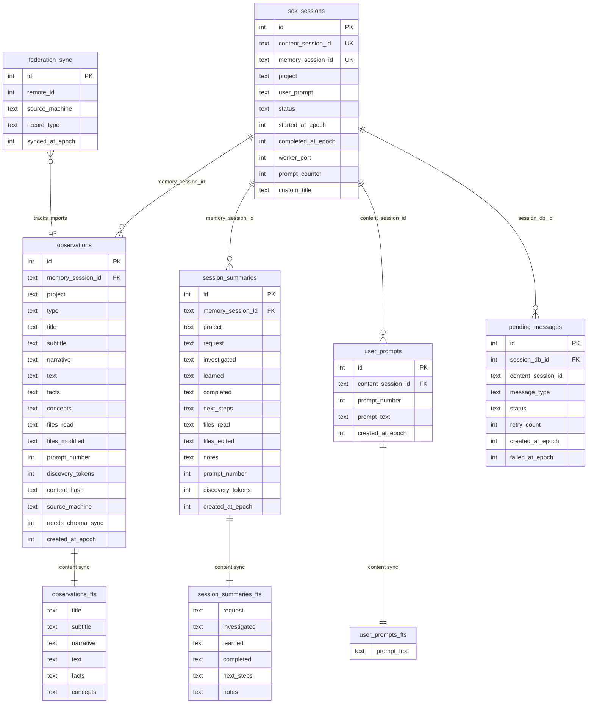

# Database Schema Reference

SQLite database stored at `~/.claude-mem/claude-mem.db`, configured with WAL journal mode for concurrent read access.

Two migration systems manage the schema:

1. **DatabaseManager** (`src/services/sqlite/migrations.ts`) -- Legacy migrations 1-7, applied first during startup.
2. **SessionStore** (inline in `src/services/sqlite/SessionStore.ts`) -- Migrations 4-25, run in the constructor with `IF NOT EXISTS` guards for idempotency.

Both systems coexist; the SessionStore migrations re-declare early tables defensively so fresh installations work without the legacy path.

---

## Schema Diagram

---

## Legacy Tables

Created by DatabaseManager migration 001. Some may be empty in newer installations where all activity flows through the SDK agent tables.

### sessions

Core session tracking.

| Column | Type | Default | Notes |
|--------|------|---------|-------|
| id | INTEGER | -- | PRIMARY KEY AUTOINCREMENT |
| session_id | TEXT | -- | UNIQUE NOT NULL |
| project | TEXT | -- | NOT NULL |
| created_at | TEXT | -- | NOT NULL, ISO-8601 |
| created_at_epoch | INTEGER | -- | NOT NULL |
| source | TEXT | `'compress'` | NOT NULL |
| archive_path | TEXT | -- | Path to compressed archive |
| archive_bytes | INTEGER | -- | Archive size |
| archive_checksum | TEXT | -- | Integrity check |
| archived_at | TEXT | -- | ISO-8601 |
| metadata_json | TEXT | -- | Arbitrary JSON blob |

**Indexes:** `idx_sessions_project(project)`, `idx_sessions_created_at(created_at_epoch DESC)`, `idx_sessions_project_created(project, created_at_epoch DESC)`

### memories

Compressed memory chunks. Migration 002 added hierarchical fields.

| Column | Type | Default | Notes |
|--------|------|---------|-------|
| id | INTEGER | -- | PRIMARY KEY AUTOINCREMENT |
| session_id | TEXT | -- | NOT NULL, FK -> sessions |
| text | TEXT | -- | NOT NULL |
| document_id | TEXT | -- | UNIQUE, for deduplication |
| keywords | TEXT | -- | Comma-separated |
| created_at | TEXT | -- | NOT NULL, ISO-8601 |
| created_at_epoch | INTEGER | -- | NOT NULL |
| project | TEXT | -- | NOT NULL |
| archive_basename | TEXT | -- | Source archive reference |
| origin | TEXT | `'transcript'` | NOT NULL |
| title | TEXT | -- | Migration 002 |
| subtitle | TEXT | -- | Migration 002 |
| facts | TEXT | -- | Migration 002, JSON array |
| concepts | TEXT | -- | Migration 002, JSON array |
| files_touched | TEXT | -- | Migration 002, JSON array |

### overviews

Session summaries, one per project.

| Column | Type | Default | Notes |
|--------|------|---------|-------|
| id | INTEGER | -- | PRIMARY KEY AUTOINCREMENT |
| session_id | TEXT | -- | FK -> sessions |
| content | TEXT | -- | Summary text |
| created_at | TEXT | -- | ISO-8601 |
| created_at_epoch | INTEGER | -- | -- |
| project | TEXT | -- | -- |
| origin | TEXT | -- | -- |

### diagnostics

System health and debug info.

| Column | Type | Default | Notes |
|--------|------|---------|-------|
| id | INTEGER | -- | PRIMARY KEY AUTOINCREMENT |
| session_id | TEXT | -- | FK -> sessions |
| message | TEXT | -- | Diagnostic message |
| severity | TEXT | -- | e.g., info, warn, error |
| created_at | TEXT | -- | ISO-8601 |
| created_at_epoch | INTEGER | -- | -- |
| project | TEXT | -- | -- |
| origin | TEXT | -- | -- |

### transcript_events

Raw conversation events captured from Claude Code sessions.

| Column | Type | Default | Notes |
|--------|------|---------|-------|
| id | INTEGER | -- | PRIMARY KEY AUTOINCREMENT |
| session_id | TEXT | -- | FK -> sessions |
| project | TEXT | -- | -- |
| event_index | INTEGER | -- | Position in transcript |
| event_type | TEXT | -- | e.g., user, assistant, tool |
| raw_json | TEXT | -- | Full event payload |
| captured_at | TEXT | -- | ISO-8601 |
| captured_at_epoch | INTEGER | -- | -- |

**Constraints:** `UNIQUE(session_id, event_index)`

---

## Core Tables

Created by SessionStore inline migrations. These are the primary tables for active use.

### sdk_sessions

Maps `content_session_id` (from Claude Code) to `memory_session_id` (internal).

| Column | Type | Default | Notes |
|--------|------|---------|-------|
| id | INTEGER | -- | PRIMARY KEY AUTOINCREMENT |
| content_session_id | TEXT | -- | UNIQUE NOT NULL, from Claude Code SDK |
| memory_session_id | TEXT | -- | UNIQUE, internal identifier |
| project | TEXT | -- | NOT NULL |
| user_prompt | TEXT | -- | Initial prompt text |
| started_at | TEXT | -- | NOT NULL, ISO-8601 |
| started_at_epoch | INTEGER | -- | NOT NULL |
| completed_at | TEXT | -- | ISO-8601 |
| completed_at_epoch | INTEGER | -- | -- |
| status | TEXT | `'active'` | CHECK IN ('active', 'completed', 'failed') |
| worker_port | INTEGER | -- | Migration 5, port of assigned worker |
| prompt_counter | INTEGER | `0` | Migration 6, incremented per user prompt |
| custom_title | TEXT | -- | Migration 23, user-defined session label |

### observations

Core observation store. Each row is a distilled observation from tool use or conversation.

| Column | Type | Default | Notes |
|--------|------|---------|-------|
| id | INTEGER | -- | PRIMARY KEY AUTOINCREMENT |
| memory_session_id | TEXT | -- | NOT NULL, FK -> sdk_sessions ON DELETE CASCADE ON UPDATE CASCADE |
| project | TEXT | -- | NOT NULL |
| text | TEXT | -- | Nullable since migration 9 |
| type | TEXT | -- | NOT NULL, e.g., tool_use, conversation |
| title | TEXT | -- | Migration 8 |
| subtitle | TEXT | -- | Migration 8 |
| facts | TEXT | -- | Migration 8, JSON array |
| narrative | TEXT | -- | Migration 8 |
| concepts | TEXT | -- | Migration 8, JSON array |
| files_read | TEXT | -- | Migration 8, JSON array |
| files_modified | TEXT | -- | Migration 8, JSON array |
| prompt_number | INTEGER | -- | Migration 6, which prompt produced this |
| discovery_tokens | INTEGER | `0` | Migration 11, token cost tracking |
| content_hash | TEXT | -- | Migration 22, deduplication hash |
| source_machine | TEXT | -- | Migration 24, NULL means local origin |
| needs_chroma_sync | INTEGER | `0` | Migration 25, dirty flag for ChromaDB sync |
| created_at | TEXT | -- | NOT NULL, ISO-8601 |
| created_at_epoch | INTEGER | -- | NOT NULL |

### session_summaries

Structured session summaries with semantic fields.

| Column | Type | Default | Notes |
|--------|------|---------|-------|
| id | INTEGER | -- | PRIMARY KEY AUTOINCREMENT |
| memory_session_id | TEXT | -- | NOT NULL, FK -> sdk_sessions (was UNIQUE until migration 7) |
| project | TEXT | -- | NOT NULL |
| request | TEXT | -- | What the user asked |
| investigated | TEXT | -- | What was explored |
| learned | TEXT | -- | Key findings |
| completed | TEXT | -- | What was accomplished |
| next_steps | TEXT | -- | Suggested follow-ups |
| files_read | TEXT | -- | JSON array |
| files_edited | TEXT | -- | JSON array |
| notes | TEXT | -- | Freeform notes |
| prompt_number | INTEGER | -- | Migration 6 |
| discovery_tokens | INTEGER | `0` | Migration 11 |
| created_at | TEXT | -- | NOT NULL, ISO-8601 |
| created_at_epoch | INTEGER | -- | NOT NULL |

### user_prompts

User input history. Added in migration 10.

| Column | Type | Default | Notes |
|--------|------|---------|-------|
| id | INTEGER | -- | PRIMARY KEY AUTOINCREMENT |
| content_session_id | TEXT | -- | NOT NULL, FK -> sdk_sessions.content_session_id |
| prompt_number | INTEGER | -- | NOT NULL |
| prompt_text | TEXT | -- | NOT NULL |
| created_at | TEXT | -- | NOT NULL, ISO-8601 |
| created_at_epoch | INTEGER | -- | NOT NULL |

### pending_messages

Persistent work queue for the async worker. Added in migration 16.

| Column | Type | Default | Notes |
|--------|------|---------|-------|
| id | INTEGER | -- | PRIMARY KEY AUTOINCREMENT |
| session_db_id | INTEGER | -- | NOT NULL, FK -> sdk_sessions.id |
| content_session_id | TEXT | -- | NOT NULL |
| message_type | TEXT | -- | NOT NULL, CHECK IN ('observation', 'summarize') |
| tool_name | TEXT | -- | Tool that produced the data |
| tool_input | TEXT | -- | Tool input JSON |
| tool_response | TEXT | -- | Tool output JSON |
| cwd | TEXT | -- | Working directory at capture time |
| last_user_message | TEXT | -- | Context: last user message |
| last_assistant_message | TEXT | -- | Context: last assistant message |
| prompt_number | INTEGER | -- | Which prompt produced this |
| status | TEXT | `'pending'` | CHECK IN ('pending', 'processing', 'processed', 'failed') |
| retry_count | INTEGER | `0` | Number of processing attempts |
| created_at_epoch | INTEGER | -- | NOT NULL |
| started_processing_at_epoch | INTEGER | -- | When worker began processing |
| completed_at_epoch | INTEGER | -- | When processing finished |
| failed_at_epoch | INTEGER | -- | Migration 20, when last failure occurred |

### federation_sync

Cross-machine sync tracking. Added in migration 24.

| Column | Type | Default | Notes |
|--------|------|---------|-------|
| id | INTEGER | -- | PRIMARY KEY AUTOINCREMENT |
| remote_id | INTEGER | -- | NOT NULL, id on the source machine |
| source_machine | TEXT | -- | NOT NULL, originating machine name |
| record_type | TEXT | -- | NOT NULL, e.g., 'observation' |
| synced_at_epoch | INTEGER | -- | NOT NULL |

**Constraints:** `UNIQUE(remote_id, source_machine, record_type)`

### schema_versions

Tracks which migrations have been applied.

| Column | Type | Default | Notes |
|--------|------|---------|-------|
| id | INTEGER | -- | PRIMARY KEY |
| version | INTEGER | -- | UNIQUE NOT NULL, migration number |
| applied_at | TEXT | -- | NOT NULL, ISO-8601 |

---

## FTS5 Virtual Tables

SQLite full-text search indexes for fast keyword lookups. These are contentless-content tables backed by their parent tables, kept in sync via triggers.

### observations_fts

Full-text search on observations. Created in migration 006.

| Column | Source |
|--------|--------|
| title | observations.title |
| subtitle | observations.subtitle |
| narrative | observations.narrative |
| text | observations.text |
| facts | observations.facts |
| concepts | observations.concepts |

**Configuration:** `content='observations'`, `content_rowid='id'`

**Sync triggers:** `observations_ai` (after insert), `observations_ad` (after delete), `observations_au` (after update)

### session_summaries_fts

Full-text search on session summaries. Created in migration 006.

| Column | Source |
|--------|--------|
| request | session_summaries.request |
| investigated | session_summaries.investigated |
| learned | session_summaries.learned |
| completed | session_summaries.completed |
| next_steps | session_summaries.next_steps |
| notes | session_summaries.notes |

**Configuration:** `content='session_summaries'`, `content_rowid='id'`

### user_prompts_fts

Full-text search on user prompts. Created in migration 10.

| Column | Source |
|--------|--------|
| prompt_text | user_prompts.prompt_text |

**Configuration:** `content='user_prompts'`, `content_rowid='id'`

---

## Migration History

### DatabaseManager Migrations (migrations.ts)

| Version | Description |
|---------|-------------|
| 001 | Core tables: sessions, memories, overviews, diagnostics, transcript_events |
| 002 | Hierarchical memory fields on memories table (title, subtitle, facts, concepts, files_touched) |
| 003 | streaming_sessions table (later dropped in 005) |
| 004 | SDK agent tables: sdk_sessions, observations, session_summaries, observation_queue |
| 005 | Drop orphaned tables: streaming_sessions, observation_queue |
| 006 | FTS5 virtual tables (observations_fts, session_summaries_fts) and sync triggers |
| 007 | discovery_tokens columns on observations and session_summaries |

### SessionStore Inline Migrations

| Version | Description |
|---------|-------------|
| SS-4 | Core tables (sdk_sessions, observations, session_summaries) with IF NOT EXISTS |
| SS-5 | worker_port column on sdk_sessions |
| SS-6 | prompt_counter on sdk_sessions, prompt_number on observations and session_summaries |
| SS-7 | Remove UNIQUE constraint on session_summaries.memory_session_id |
| SS-8 | Hierarchical fields on observations (title, subtitle, facts, narrative, concepts, files_read, files_modified) |
| SS-9 | Make observations.text nullable |
| SS-10 | user_prompts table with FTS5 index |
| SS-11 | discovery_tokens columns on observations and session_summaries |
| SS-16 | pending_messages table (persistent work queue) |
| SS-17 | Rename session ID columns (claude_session_id -> content_session_id, sdk_session_id -> memory_session_id) |
| SS-18 | Repair column rename (fixes cases where SS-17 partially applied) |
| SS-20 | failed_at_epoch column on pending_messages |
| SS-21 | ON UPDATE CASCADE for FK constraints (recreates observations + session_summaries with new constraints) |
| SS-22 | content_hash column on observations (deduplication) |
| SS-23 | custom_title column on sdk_sessions |
| SS-24 | federation_sync table + source_machine column on observations |
| SS-25 | needs_chroma_sync column on observations (dirty flag for ChromaDB vector sync) |
